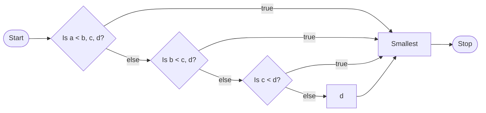
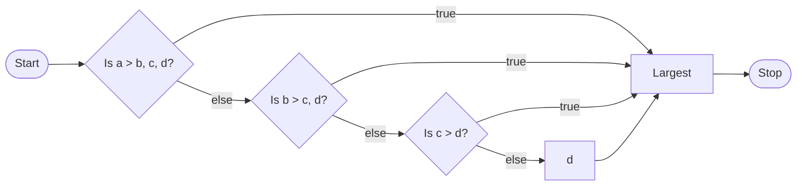

# Exercise 1: Find Min and Max
## **Description**

Write a program that asks the user to input 4 numbers and displays the minimum and maximum values.
## **Pseudocode**
- Prompt user for four numbers, save as `a, b, c, d`.

- Find min, starting with whether `a < b, c, d`. Save as `smallest` if true.

- Eliminate the previous variable from the comparison each time a smaller number is found.

- Find max by mirroring the algorithm for finding min.

- Output smallest and largest numbers.
## Flowchart


## **Output**
```

C:\****>a

Enter 4 numbers: 4 5 3 9

  

The smallest number is: 3

The largest number is: 9

  

C:\****>a

Enter 4 numbers: -5.3 10.95 -1 1

  

The smallest number is: -5.3

The largest number is: 10.95

```
