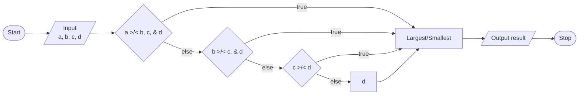

# Exercise 1: Find Min and Max
### Description
Write a program that asks the user to input 4 numbers and displays the minimum and maximum values.
<br/><br/>
### Pseudocode
- Prompt user for four numbers, save as `a, b, c, d`.
- Find min, starting with whether `a < b, c, & d`. Save as `smallest` if true.
  - Eliminate the previous variable from the comparison each time a smaller number is found.
  - Find max by mirroring the algorithm for finding min.
- Output `smallest` and `largest`.
<br/><br/>
### Flowchart

<br/><br/>
### Output
```
C:\****\Week-2\Exercise 1>a

Enter 4 numbers: 5 9 2 6

The smallest number is: 2
The largest number is: 9

C:\****\Week-2\Exercise 1>a

Enter 4 numbers: 10 -5 92.62 6.4

The smallest number is: -5
The largest number is: 92.62
```
