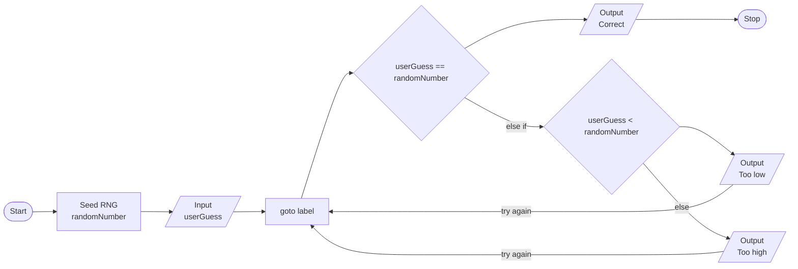

# Exercise 3: Guess a Number Between 1-100
### Description
Write a program that picks a random number between 1 and 100 inclusive. It then prompts the user to guess the number. If the user guesses the number, print out a congratulatory message and exit. Otherwise, indicate whether the guess was low or high and ask the user to try again.

*Hint: Use the rand() function.*
<br/><br/>
### Pseudocode
- Seed random number generator, save as `randomNumber`.
- Prompt user for a guess, save as `userGuess`.
- Create `goto` label `begin`.
- Output a congratulatory message if the user guesses the correct number.
  - Prompt user for another guess if the previous guess was too low, `goto begin`.
  - Do the same for other case.
<br/><br/>
### Flowchart

<br/><br/>
### Output
```
C:\***\Week-2\Exercise 3>a

Guess a number between 1 and 100: 50

Too low
Try again: 80

Too high
Try again: 65

Too high
Try again: 55

Too low
Try again: 58

Too low
Try again: 62

Too high
Try again: 60

Too low
Try again: 61

Congratulations! You guessed the correct number!
```
