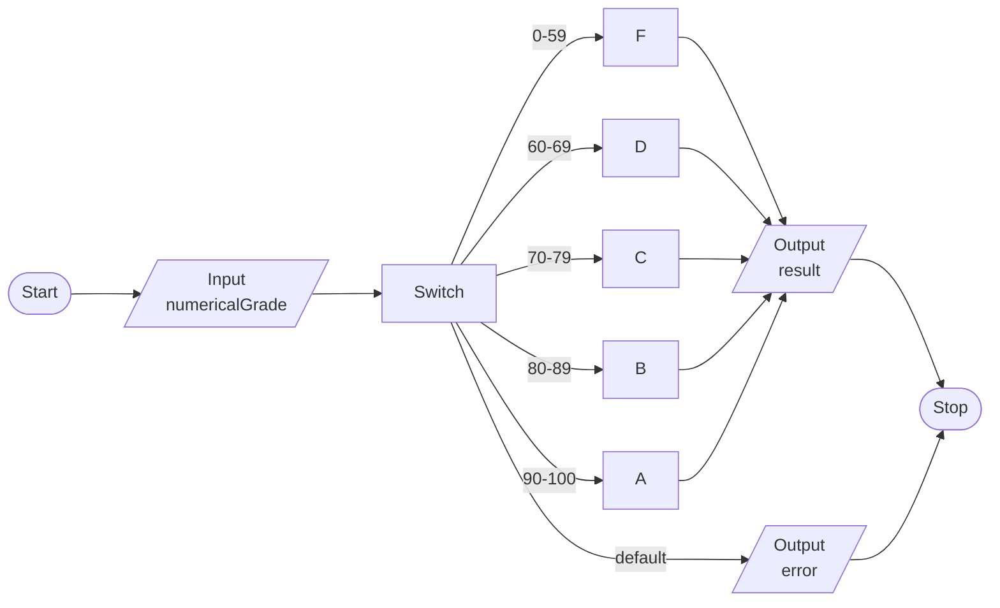

# Exercise 4: Convert Numerical Grade to Letter Grade
### Description
Using the switch statement write a program that converts a numerical grade into a letter grade:

`Enter numerical grade: 76`
`Letter grade is: C`

Use the following grading scale: A = 90-100, B=80-89, C=70-79, D=60-69, F=0-59. Print an error message if the grade is greater than 100 or less than 0. 
<br/><br/>
### Pseudocode
- Seed random number generator, save as `randomNumber`.
- Prompt user for a guess, save as `userGuess`.
- Create `goto` label `begin`.
- Output a congratulatory message if the user guesses the correct number.
  - Prompt user for another guess if the previous guess was too low, `goto begin`.
  - Do the same for other case.
<br/><br/>
### Flowchart

<br/><br/>
### Output
```
C:\***\Week-2\Exercise 4>a

Enter numerical grade: 29

Letter grade is: F

C:\***\Week-2\Exercise 4>a

Enter numerical grade: 59

Letter grade is: F

C:\***\Week-2\Exercise 4>a

Enter numerical grade: 65

Letter grade is: D

C:\***\Week-2\Exercise 4>a

Enter numerical grade: 73

Letter grade is: C

C:\***\Week-2\Exercise 4>a

Enter numerical grade: 80

Letter grade is: B

C:\***\Week-2\Exercise 4>a

Enter numerical grade: 95

Letter grade is: A

C:\***\Week-2\Exercise 4>a

Enter numerical grade: 100

Letter grade is: A

C:\***\Week-2\Exercise 4>a

Enter numerical grade: -1

Numericle grade must be between 1-100

C:\***\Week-2\Exercise 4>a

Enter numerical grade: 101

Numericle grade must be between 1-100
```
