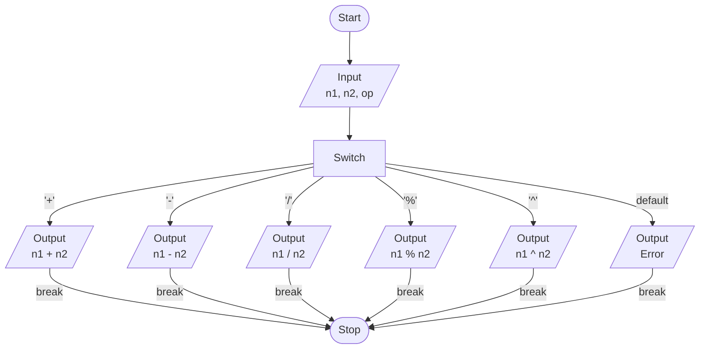

# Exercise 6: Calculator
### Description
Write a program that takes as input two numbers and one of the following operators: ‘+’, ‘-‘, ‘/’, ‘%’, ‘^’ and returns the output of the operation requested.

‘^’ represents the power operator and can be implemented using the pow() function in the <math.h> library.
<br/><br/>
### Pseudocode
- Prompt user to enter two numbers separated by an operator, save as `n1, n2, op`.
- Compute result of operation on `n1` and `n2` using switch statement.
- Output result of operation on `n1` and `n2` for each case.
- Output error message for default case to handle unexpected input.
<br/><br/>
### Flowchart

<br/><br/>
### Output
```
C:\****\Week-2\Exercise 6>a

Allowed operators: '+' '-' '/' '%' '^'
Enter two numbers separated by an operator: 2+2

2+2 = 4

C:\****\Week-2\Exercise 6>a

Allowed operators: '+' '-' '/' '%' '^'
Enter two numbers separated by an operator: 66.6-100

66.6-100 = -33.4

C:\****\Week-2\Exercise 6>a

Allowed operators: '+' '-' '/' '%' '^'
Enter two numbers separated by an operator: 42/10

42/10 = 4.2

C:\****\Week-2\Exercise 6>a

Allowed operators: '+' '-' '/' '%' '^'
Enter two numbers separated by an operator: 15.6%2

15.6%2 = 1.6

C:\****\Week-2\Exercise 6>a

Allowed operators: '+' '-' '/' '%' '^'
Enter two numbers separated by an operator: 3.14^7

3.14^7 = 3009.59
```
