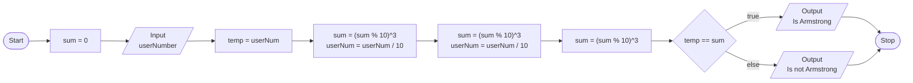

# Exercise 7: Armstrong Number
### Description
Write a program that takes as input a three digit number and checks whether the number is an Armstrong number or not. A number is Armstrong if the sum of cubes of individual digits of a number is equal to the number itself. 

For example 371 is an Armstrong number as 333 + 777 + 111 = 371. Some other Armstrong numbers are: 0, 1, 153, 370, 407.
<br/><br/>
### Pseudocode
- Initialise the variable `sum` to `0`.
- Prompt user to enter a three digit number, save as `userNum`.
- Store value of `userNum` in `temp`.
- Compute sum of the cubes of the digits of `userNum`, save as `sum`.
- Output that the number is an Armstrong number if `temp = sum`, else output that it is not an Armstrong number.
<br/><br/>
### Flowchart

<br/><br/>
### Output
```
C:\***\Week-2\Exercise 7>a

Enter a three digit number: 153

153 is an Armstrong number.

C:\***\Week-2\Exercise 7>a

Enter a three digit number: 152

152 is not an Armstrong number.

C:\***\Week-2\Exercise 7>a

Enter a three digit number: 1

1 is an Armstrong number.

C:\***\Week-2\Exercise 7>a

Enter a three digit number: 371

371 is an Armstrong number.

C:\***\Week-2\Exercise 7>a

Enter a three digit number: 20

20 is not an Armstrong number.
```
