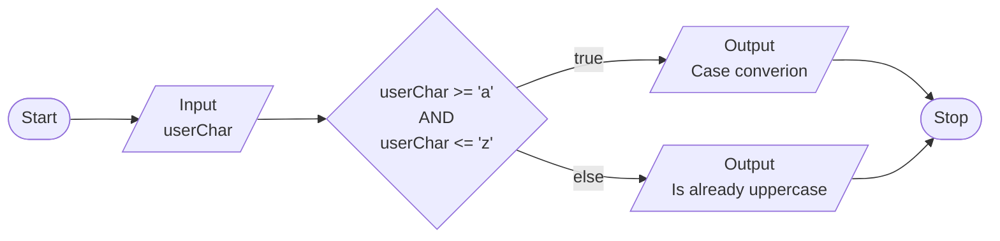

# Exercise 8: Character Case Detection and Conversion
### Description
Write a program that takes as input a character and tests whether the character is upper case or not. In the case it is not, convert the character to upper case. Display the input and output on screen.
<br/><br/>
### Pseudocode
- Prompt user to enter a character, save as `userChar`.
- Test `userChar` is uppercase or not if ASCII value of `userChar` is between 97 and 122.
- Output converted `userChar` using `toupper()` if lowercase.
- Output that `userChar` is already uppercase if not.
<br/><br/>
### Flowchart

<br/><br/>
### Output
```
C:\***\Week-2\Exercise 8>a

Enter a character: g

Input: g        Output: G

C:\***\Week-2\Exercise 8>a

Enter a character: H

The character you entered is already uppercase.

C:\***\Week-2\Exercise 8>a

Enter a character: y

Input: y        Output: Y
```
